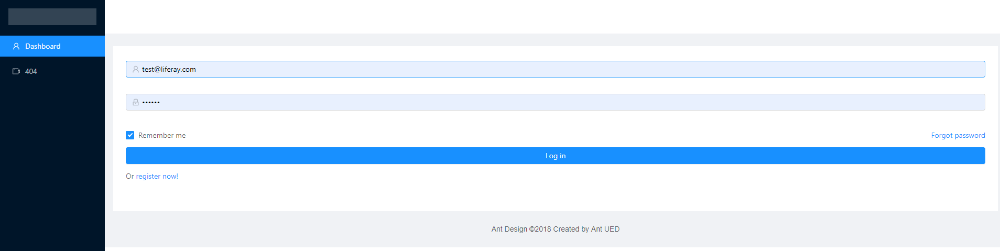

# vue-demo

## Backend API support this project

Please refer to [Backend Project](https://github.com/longlv91/nestjs-backend)

After running backend project, you can see API Docs in http://localhost:3333/apidocs/

## Project setup
```
npm install
```

### Compiles and hot-reloads for development
```
npm run serve
```

### Compiles and minifies for production
```
npm run build
```

### Run your tests
```
npm run test
```

### Lints and fixes files
```
npm run lint
```

### Screenshot application

<p align="center"></p>


### Customize configuration
See [Configuration Reference](https://cli.vuejs.org/config/).
